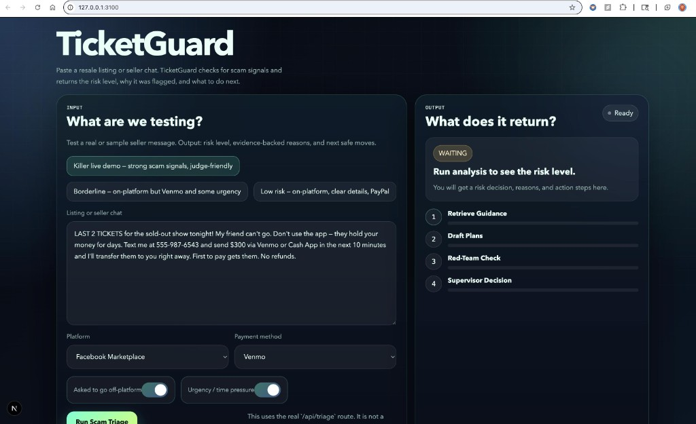
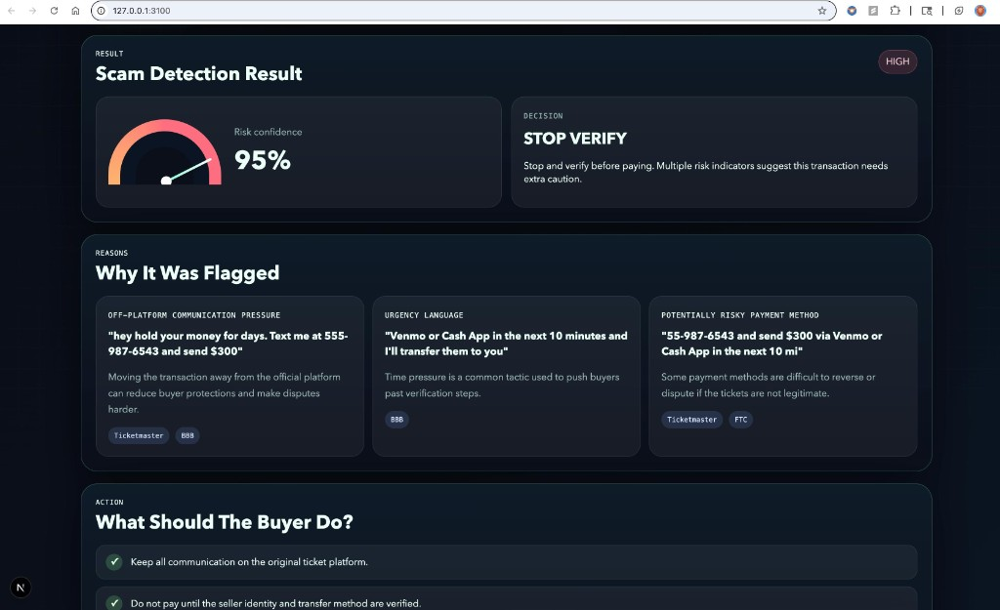
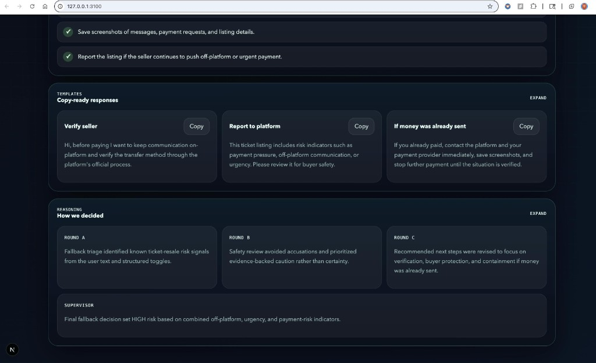

# TicketGuard — Ticket Resale Scam Triage

TicketGuard helps fans buying resale tickets under time pressure quickly assess **scam risk indicators** and follow **safer steps** — reducing losses, anxiety, and decision paralysis.

This is **not** a chatbot. It's an **action-first dashboard**: paste a listing/seller chat → get a **risk level + confidence**, **top reasons with evidence**, a **safer-step checklist**, and **copyable templates** (verification message + platform report + containment steps).

**Live:** [hack-ticket-resla-triage.vercel.app](https://hack-ticket-resla-triage.vercel.app)

Built at the **NVIDIA + Vercel Hackathon** hosted at San Jose State University during NVIDIA GTC 2026.

---

## Screenshots

### Triage dashboard (input + agent pipeline)


### Results (risk decision + reasons + actions)


### Results (templates + reasoning expanded)


---

## What makes it "agentic" (not just text generation)

TicketGuard uses a **multi-agent Chain-of-Debate (CoD)** workflow:
- Draft multiple candidate plans (Planner / Evidence / User Advocate)
- Critique plans (Red-Team + Risk/Compliance)
- Supervisor selects final response with **confidence** and a short rationale log
- **Boundary Manager** behavior: for high risk, escalates to "Stop & Verify" steps

---

## Tech Stack

- **Frontend:** Next.js 15 (App Router) + TypeScript + Tailwind + shadcn/ui
- **Backend:** Next.js API Route `POST /api/triage` (Vercel Serverless)
- **LLM:** NVIDIA NIM endpoint — Nemotron (`nvidia/nemotron-3-super-120b-a12b`)
- **Grounding:** Static guidance corpus (FTC, BBB, Ticketmaster) bundled at build time as TypeScript constants
- **Deployment:** Vercel

---

## Architecture

```
User → Next.js UI (Vercel) → POST /api/triage (Serverless)
    → Static Guidance Context → CoD Orchestrator
    → LLM via NVIDIA NIM (Nemotron)
    → JSON → UI (Risk + Reasons + Actions + Templates + CoD log)
```

---

## Project Structure

```
ticketguard/
├── src/
│   ├── app/
│   │   ├── api/triage/route.ts       # API route — calls Nemotron, returns JSON
│   │   ├── page.tsx                  # Main UI
│   │   ├── layout.tsx
│   │   └── globals.css
│   └── lib/
│       ├── data/
│       │   ├── systemPrompt.ts       # System prompt (bundled static string)
│       │   └── guidanceContext.ts    # All guidance docs (bundled static string)
│       ├── llm/
│       │   └── nimClient.ts          # NVIDIA NIM API client
│       ├── triage/
│       │   ├── fallback.ts           # Graceful fallback if LLM fails
│       │   ├── normalize.ts          # Input normalization
│       │   ├── validate.ts           # Response validation
│       │   └── smoke.ts
│       └── types/
│           └── triage.ts             # TypeScript types
├── data/guidance/                    # Source guidance .md files (for reference)
├── prompts/prompt.txt                # Source system prompt (for reference)
├── next.config.ts
├── vercel.json
└── package.json
```

---

## What was changed for Vercel compatibility

| File | Change | Reason |
|---|---|---|
| `src/lib/llm/nimClient.ts` | Removed `fs.readFile` / `readdir` for prompt and guidance files | Vercel serverless functions cannot read arbitrary files at runtime — the filesystem is frozen |
| `src/lib/data/systemPrompt.ts` | **New file** — system prompt exported as a TypeScript string constant | Replaces runtime `fs.readFile("prompts/prompt.txt")` with a build-time import |
| `src/lib/data/guidanceContext.ts` | **New file** — all 4 guidance `.md` files combined as a TypeScript string constant | Replaces runtime `fs.readdir("data/guidance/")` with a build-time import |
| `package.json` | `next` bumped `15.2.2 → 15.2.6`, `react` / `react-dom` bumped `19.0.0 → 19.0.3` | **Security fix:** CVE-2025-66478 (CVSS 10.0) — RCE vulnerability in React Server Components affecting all Next.js 15.x builds below 15.2.6 |

---

## Security

This project was updated to patch **CVE-2025-66478** — a critical (CVSS 10.0) Remote Code Execution vulnerability in React Server Components affecting Next.js 15.0–15.2.5.

**Patched versions in use:**
- `next`: 15.2.6
- `react` / `react-dom`: 19.0.3

---

## Setup (local)

### 1. Install

```bash
# Node 18+ required (20+ recommended)
npm install
```

### 2. Environment variables

Create `.env.local`:

```bash
NIM_BASE_URL=https://integrate.api.nvidia.com/v1
NIM_API_KEY=your_nvidia_nim_api_key
NIM_MODEL=nvidia/nemotron-3-super-120b-a12b
NIM_TIMEOUT_MS=20000
```

### 3. Run

```bash
npm run dev
```

Open [http://localhost:3000](http://localhost:3000)

---

## Deployment to Vercel

1. **Push to GitHub:**
```bash
git add .
git commit -m "Initial commit"
git push origin main
```

2. **Import to Vercel:**
- Go to [vercel.com](https://vercel.com) → **Add New Project** → import your repo
- Vercel auto-detects Next.js — no build config needed

3. **Add environment variables** in Vercel → Settings → Environment Variables:

| Key | Value |
|---|---|
| `NIM_API_KEY` | Your NVIDIA NIM API key |
| `NIM_BASE_URL` | `https://integrate.api.nvidia.com/v1` |
| `NIM_MODEL` | `nvidia/nemotron-3-super-120b-a12b` |
| `NIM_TIMEOUT_MS` | `20000` |

4. **Deploy** — live in ~60 seconds. Redeploys automatically on every `git push`.

---

## API Contract

**POST** `/api/triage`

Request:
```json
{
  "text": "string",
  "platform": "string",
  "payment_method": "string",
  "off_platform": true,
  "urgency": true
}
```

Response:
```json
{
  "risk_level": "LOW|MEDIUM|HIGH",
  "confidence": 0.82,
  "banner": { "type": "STOP_VERIFY|VERIFY_FIRST|PROCEED_SAFER", "message": "string" },
  "reasons": [
    { "title": "string", "evidence_snippet": "string", "guidance_links": ["string"], "notes": "string" }
  ],
  "action_steps": ["string"],
  "templates": {
    "verify_message": "string",
    "platform_report": "string",
    "containment_steps": "string"
  },
  "cod_log": { "roundA": "string", "roundB": "string", "roundC": "string", "supervisor": "string" }
}
```

---

## Safety & Guardrails

- **Non-accusatory language:** "risk indicators suggest…" not "this is a scam"
- **No enabling wrongdoing:** no instructions for bypassing ticket limits or fraud
- **Victim path:** if the user already paid, containment steps + reporting guidance are included
- **Disclaimer:** "Educational guidance only; cannot guarantee authenticity."

---

## Demo Mode

Two preset examples are built into the UI:
- **Obvious scam** — off-platform + irreversible payment + urgency
- **Borderline legit** — in-platform transfer + safer payment method

---

## Academic Context

Built at the NVIDIA + Vercel Hackathon hosted at San Jose State University during NVIDIA GTC 2026, as part of the Applied Data Intelligence MS program.

---

## Contact

**Utkarsh Tripathi**
- GitHub: [@utkarsh9630](https://github.com/utkarsh9630)
- LinkedIn: [Utkarsh Tripathi](https://www.linkedin.com/in/tripathiutkarsh46/)
- Email: tripathiutkarsh46@gmail.com

MS Student — Applied Data Intelligence, San Jose State University
